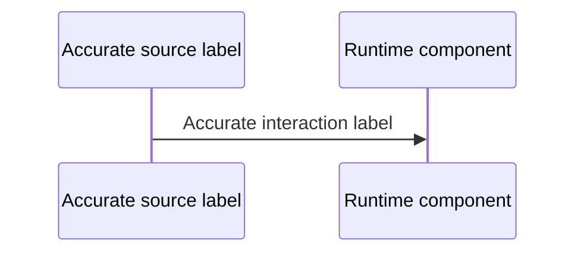

# PR Description Creation Instructions

Write PR descriptions for reviewers, not for local implementation planning.

## Rules

- Do not mention internal phase names, local planning labels, or private implementation sequencing unless reviewers already know them.
- Describe the user-facing or operator-facing change in plain project terms.
- Avoid vague words like "guardrails" unless the exact mechanism is named.
- If a statement depends on configuration, use the precise configured scope. For example, say "pods in monitored namespaces" instead of "GoodKey pods" when collection is namespace-scoped.
- Keep the summary short and factual. Include only what changed and why reviewers need to know it.
- Add a `## Testing` section only when it gives reviewers a meaningful, reproducible way to verify the changed behavior. Omit it when the available evidence is only routine syntax, formatting, diff-hygiene, or other pre-merge checks.
- A command by itself is not useful testing evidence. Include it only with the behavior it verifies and its result; do not turn incomplete local status into a PR-body checklist.
- Include manual verification steps when the PR changes deployed infrastructure or UI-visible behavior.
- Include secrets, port-forwarding, URLs, or dashboard paths needed for reviewers to verify the change.
- Use Mermaid diagrams only when they clarify runtime flow. Keep labels accurate and scoped to the actual config.
- When explaining a technology choice, include the real selection reason: maintainership, adoption, official or widely used references, integration value, operational tradeoff, or compatibility with existing project constraints.
- Return the final PR description as Markdown only for the PR body; do not edit the PR directly.

## How to get diff

If the source of changes is not explicit, stop and ask the user to choose one scope before reading anything:

- Review the remote branch against the base branch.
- Review the remote branch plus local changes against the base branch.
- Review only the local diff.

Use exactly the scope the user picked; do not mix scopes or silently fall back to another one.

1. Remote branch against the base branch:
 `gh pr view`
 `gh pr diff`
2. Remote branch plus local changes against the base branch:
 `gh pr view`
 `gh pr diff`
 `git diff --staged`
 `git diff`
3. Only local diff:
 `git diff --staged`
 `git diff`

If you need structured data for the description, add `--json` to `gh pr view` and filter with `--jq`.

## Recommended Structure

```md
<"Issue" or "Fix" or "Implement">: <number of resolved issue/part of the issue/comment>

## Summary
<One sentence explaining what this PR does and why it matters>

## How it works


## Testing
<Optional: add only if reviewers can use this section to verify changed behavior. State the behavior, then copy-pasteable commands or steps and their result. Omit the entire section for syntax checks, formatting checks, `git diff --check`, or unresolved failures that should be fixed before merge.>

## Manual migrations
<This section is optional and should be added only when infra changes require manual follow-up>
<Write this as a todo list. Each item must start with `- [ ]` and a verb, e.g. `- [ ] Create monitoring InstanceGroup for Production`.>

## Notes
- <Deployment scope or rollout note>
- <Known deferred work, without internal phase labels>
```

## Writing Guidance

- Replace internal milestone names with the actual product, API, infrastructure, or behavior change.
- Prefer exact nouns over broad labels. Name the affected service, route, script, chart, dashboard, job, or workflow.
- Make scope explicit when it matters. Say which environments, namespaces, services, users, or data paths are affected.
- Do not imply wider coverage than the implementation provides.
- Keep decision rationale dense. Do not expand it with generic benefits; name the concrete reason the chosen option is better than the main alternative.
- If the PR adds a setup or rollout script, mention what it installs or changes and where it runs.
- If the PR adds UI, dashboards, or deployed infrastructure, include the access path reviewers need to inspect it.
- If credentials are needed for review, document how to read the relevant secret without exposing secret values in the PR body.
- Do not report failed checks caused by this PR as a known issue; fix them before the PR is ready. Mention an unrelated validation failure only when it materially affects reviewer verification, and include the command, failure, and why it is unrelated.
- Omit `## Testing` rather than filling it with `bash -n`, `git diff --check`, formatting, or similar hygiene output. These can support local confidence, but they do not tell reviewers how the change works or what to verify.
- If a diagram is included, keep it at the level of actual runtime behavior. Do not add speculative or future components.
