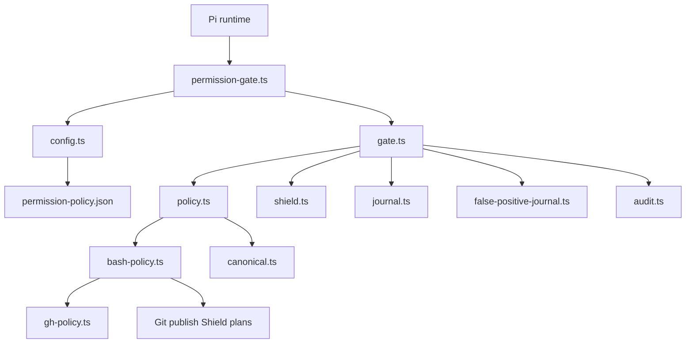
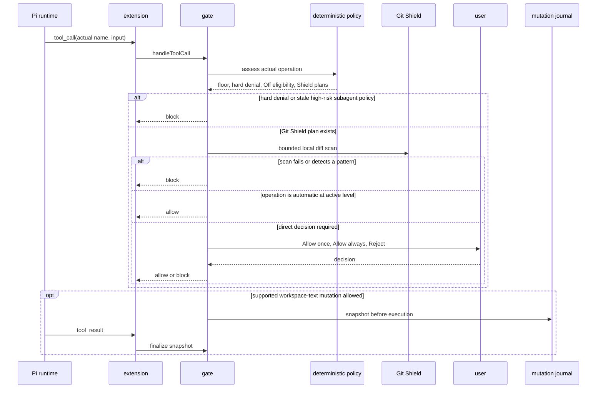

# Pi permission gate

This directory contains the permission boundary for Pi-mediated tool calls. It computes a deterministic risk floor from the actual tool name and arguments, applies an Off-to-High session Autonomy Level, asks the user directly when needed, journals supported workspace-text mutations, runs bounded Git Shield scans before Pi-mediated publishes, and records redacted audit facts.

The version-controlled source lives under `./.pi/agent/`. Install it with `./.pi/install_pi_permission_gate.sh`; the installer copies the runtime modules to `~/.pi/agent/security/` and adds the explicit extension path without replacing unrelated Pi settings.

## Scope and boundary

The gate covers tool calls that Pi delivers through its `tool_call` event, including built-in tools and registered custom tools. It does not cover:

- user-initiated Pi shell commands with `!` or `!!`;
- direct Node APIs invoked by a trusted extension;
- a process, filesystem, network, or OS sandbox;
- an actual-program resolver for arbitrary shell wrappers or aliases;
- manual Git commands outside Pi, or a complete secret scanner for every Git operation;
- Droid private implementation details or Droid Shield parity.

Install only trusted extensions. This is a trusted-runtime guardrail, not a non-bypassable security boundary.

## Components



| File | Responsibility |
| --- | --- |
| `permission-gate.ts` | Pi event adapter, direct-approval UI, `/permission-mode`, Option+L, and `permission_undo`. |
| `gate.ts` | Session state, deterministic authorization, direct approvals, Shield ordering, audit, mutation snapshots, and undo. |
| `policy.ts` | Pi tool profiles, Off eligibility, and assessment composition. |
| `bash-policy.ts` | Shell tokenizer, exact command-list matching, deterministic command policy, and Git Shield-plan emission. |
| `shield.ts` | Bounded local Git-diff reader and redacting publish scanner. |
| `gh-policy.ts` | Explicit GitHub CLI command-path policy. |
| `canonical.ts` | Workspace path identity, protected-path checks, stable serialization, and digests. |
| `journal.ts` | Private pre-image snapshots and checksum-safe undo for supported workspace-text mutations. |
| `false-positive-journal.ts` | Non-authorizing audit record for a deterministic-High Allow once decision. |
| `audit.ts` | Redacted JSONL operation audit. |
| `config.ts` and `types.ts` | Version-2 policy validation and shared contracts. |

## Decision flow



Hard denials take precedence over every mode and every command list. A negative Shield scan occurs after deterministic hard-denial and subagent-revision checks, but before automatic execution or a direct prompt. No scan executes `git commit` or `git push`.

## Policy file and exact command lists

`permission-policy.json` is schema version 2. Its checked-in default is Off with empty command lists:

```json
{
  "version": 2,
  "defaultAutonomy": "off",
  "commandAllowlist": [],
  "commandDenylist": [],
  "commandBlocklist": []
}
```

Each list entry must parse as exactly one literal bare shell segment. Arguments must match exactly. A list entry cannot contain wrappers, environment assignments, shell operators, globs, substitutions, a path-qualified executable, or prefix matching.

For each Bash segment, the policy applies these stages:

1. An exact blocklist match is a hard denial.
2. The deterministic classifier computes the normal floor.
3. Existing hard denials remain intact.
4. An exact denylist match requires a direct decision without lowering the floor.
5. An exact allowlist match may lower only a non-hard-denied segment to Low.

Compound commands compose at the maximum risk. Every segment must be independently Off-eligible before a compound command can run automatically in Off.

The Bash classifier treats ambiguous syntax, dynamic expansion, environment assignments, path-qualified executables, and unknown commands as High. It canonicalizes supported filesystem-reader roots and downloader output destinations before accepting a low-risk result. Docker host-escape forms, every archive extraction form, `kubectl exec`, destructive Git and worktree operations, protected data access, credential-bearing calls, and ambiguous redirects remain High or hard-denied.

## Risk and direct approval

The gate derives Low, Medium, or High from the actual operation. A tool cannot self-classify to reduce that floor.

| Mode | Automatic execution |
| --- | --- |
| `off` | Only Low canonical `read`, `grep`, `find`, `ls`, `todo`, and `wait` operations that pass all existing checks, plus fully exact-allowlisted Low Bash segments. |
| `low` | Low operations that are not forced to direct approval. |
| `medium` | Low and Medium operations that are not forced to direct approval. |
| `high` | Low, Medium, and High operations that are not forced to direct approval. Hard denials still block. |

When an operation is not automatic, an interactive UI presents exactly **Allow once**, **Allow always**, and **Reject**:

- **Allow once** authorizes only that event. It does not change the session level.
- **Allow always** raises the session level to the stricter of the current level and the operation floor. The extension persists a `mode` entry in Pi session history and updates status before the gate commits the new in-memory level.
- **Reject**, dismissal, a missing UI, or persistence failure blocks the operation.

A deterministic-High **Allow once** writes a schema-versioned, redacted audit entry before execution. A failed journal write blocks the operation. The record is historical audit evidence only; it never participates in future authorization. Low and Medium decisions, and all Allow always decisions, do not create that record.

Supported workspace-text `edit` and `write` operations retain their existing private pre-image snapshot. `permission_undo` asks for interactive review and restores only the most recent successfully journaled target whose post-operation checksum still matches.

## Git Shield

The classifier emits a Shield plan only for bare, literal Pi-mediated `git commit` and `git push` segments. A compound invocation can create both plans. Wrappers, assignments, dynamic shell syntax, path-qualified Git executables, malformed input, and unsupported publish forms do not claim Shield coverage.

For supported forms, `shield.ts` invokes `/usr/bin/git` directly with a fixed environment and a strict `maxGitDiffBytes` cap. It reads a bounded staged or outgoing diff without invoking the requested publish. Normal commits use the staged diff; `git commit -a` and `git commit --all` include tracked working-tree changes. Supported pushes use a configured upstream, one literal remote and branch, or a verified first push. Other forms fail closed.

Only added diff lines are inspected in process memory. The scanner blocks PEM private-key headers, selected AWS, GitHub, GitLab, OpenAI, Slack, and Stripe credential patterns, plus high-entropy base64-like values assigned to secret-bearing keys. It ignores explicit inert placeholders. Results expose only generic rule identifiers, never a diff, path, excerpt, or matched value.

Shield is deliberately narrow. It is not a general secret-detection system, does not scan manual Git activity, and does not establish parity with any Droid implementation.

## Persistent records

Runtime state stays beneath `${PI_CODING_AGENT_DIR:-~/.pi/agent}` with private permissions:

```text
permission-audit/events.jsonl                     # redacted JSONL audit events
permission-journal/<sanitized-session-id>/        # mutation metadata and pre-images
security/false-positive-journal-v1.json           # direct High Allow once audit records
security/false-positive-journal.json              # untouched historical records from earlier releases
```

Audit events contain digests, risk, decision, mode, policy revision, reversibility, and redacted reasons. They do not contain complete tool input, commands, file content, paths, diffs, or credentials. The direct-approval journal preserves the same boundary and is never read to authorize another operation.

## Development and installation

```bash
cd .pi
npm run test:permission-gate
bash ./install_pi_permission_gate.sh
```

The installer copies runtime TypeScript modules with private permissions, skips test modules, removes the two retired runtime modules from an existing installation, installs the version-2 policy, and updates only the configured `extensions` array in `settings.json`.
