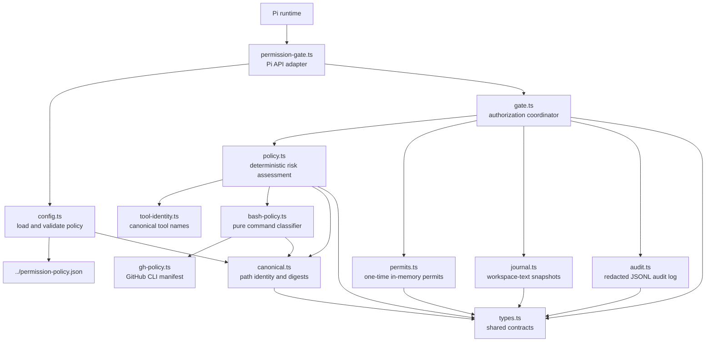
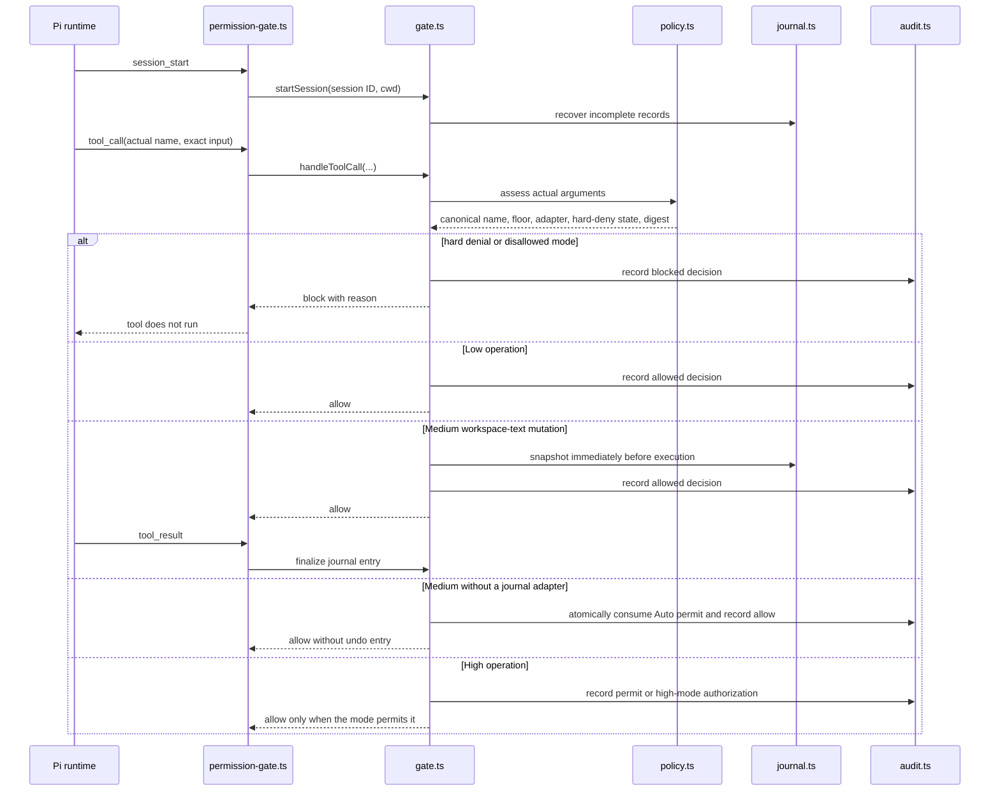

# Pi permission gate

This directory contains the enforcement core for Pi agent tool calls. It gives every call a deterministic risk floor, canonicalizes model-visible and runtime tool identities before authorization, requires a one-time permit where the active autonomy mode requires one, journals only reversible workspace-text mutations, and records a redacted audit event for every decision.

It is installed as the explicitly configured Pi extension at `~/.pi/agent/security/permission-gate.ts`. The version-controlled source lives in this repository under `./.pi/agent/`; run `./.pi/install_pi_permission_gate.sh` to copy it into Pi's agent directory without replacing unrelated Pi settings.

## Scope and boundary

The gate applies to Pi tool calls from the agent, including built-in tools and registered custom tools that pass through Pi's `tool_call` event. User-initiated Pi shell commands (`!` and `!!`) are deliberately outside this policy.

This is a guardrail for a trusted Pi runtime, not a sandbox. An extension that invokes Node APIs directly can bypass Pi's tool lifecycle, and Pi does not offer a final, non-bypassable extension hook. Install only trusted extensions. DCG is also not an authorization prerequisite until its independent fail-closed work is complete.

## How the modules fit together



`permission-gate.ts` adapts Pi events, commands, and confirmation dialogs to the framework-independent `PermissionGate` class. `gate.ts` owns the authorization state for one Pi session; the other modules each provide one narrowly scoped capability.

| File | Responsibility | Used by |
| --- | --- | --- |
| `permission-gate.ts` | Registers the extension, `/permission-mode`, `Option+L`, `permission_request`, and `permission_undo`; tells the model to declare canonical Pi tool names. | Pi runtime |
| `gate.ts` | Coordinates assessment, mode handling, canonical one-time permits, audit events, workspace-text snapshots, result finalization, and undo. | Extension and unit tests |
| `policy.ts` | Profiles Pi tools and delegates Bash; returns Low, Medium, or High with hard denials and a journal adapter. | Gate |
| `tool-identity.ts` | Strips one `functions.` prefix and normalizes `ffgrep`/`fffind` to canonical Pi tool names. | Policy and gate |
| `bash-policy.ts` | Pure tokenizer and declarative CLI policy. It classifies strings without spawning a process. | Policy and unit tests |
| `gh-policy.ts` | Enumerates every documented `gh` 2.89.0 command heading and applies path, browser, credential, alias, and bounded-local-I/O rules without invoking `gh`. | Bash policy and unit tests |
| `canonical.ts` | Rejects globs, `..`, `~`, symlinks, and out-of-workspace paths; creates stable JSON and SHA-256 digests. | Policy, Bash policy, config, journal |
| `permits.ts` | Keeps short-lived permits in memory, binds each one to a canonical operation digest, and consumes it once. | Gate |
| `journal.ts` | Takes private pre-image snapshots only before supported workspace-text mutations, finalizes post-image checksums, recovers interrupted work, and performs checksum-safe undo. | Gate |
| `audit.ts` | Appends private, redacted JSONL events under Pi's agent directory. | Gate |
| `config.ts` | Loads and validates `permission-policy.json`, then hashes it into a policy revision. | Extension |
| `types.ts` | Defines shared risk, policy, assessment, permit, journal, and audit types. | All TypeScript modules |

## Runtime flow



A `permission_request` does not execute an operation. It independently re-runs `policy.ts` over the complete proposed target call, rejects a model risk declaration below the computed floor, and creates a permit bound to the canonical tool name, exact normalized arguments, session, workspace, and policy revision. Use the canonical Pi name without a `functions.` prefix in `toolName`; one model-visible prefix is normalized so `functions.edit` and the later native `edit` event share a permit digest. In `auto` mode, the requested target must be the only tool call in the next model turn so Pi can preflight it after the permit exists.

## Risk and autonomy

The policy always computes the minimum risk from the real tool call; a model cannot lower it by declaring a lower risk.

The model supplies `declaredRisk`, `declaredRiskReason`, intent, expected effect, and rollback context for a permit request; it is not an internal risk classifier. Droid's visible `Execute` contract likewise makes the model supply `riskLevel` and a reason, but does not reveal whether any private backend verifies that declaration. Pi's gate always computes its own floor from the target call and enforces the stricter value. It records the declared risk and a redacted declared rationale when a permit is issued, consumed, or finalized.

For Auto-mode High work, the selector offers `Yes`, `Yes. Write to the false-positive-journal.json`, and `No`. The journal choice approves the exact permitted operation and records the user's suspected classification false positive before the permit is issued; it does not assert that the operation is safe. If the journal cannot be written, the operation remains denied.

- **Low** is strictly read-only safe workspace work, session-local coordination, public search retrieval, or an exact allowlisted inspection/inventory CLI operation. It runs without a permit and is audited.
- **Medium** is bounded impact: verified workspace-text `edit`/`write`, tests and builds, trusted dependency installation, selected local Git/container/cloud operations, and public fetches. Every Auto Medium call requires a permit. Only `journalAdapter: "workspace-text"` is undoable; `journalAdapter: "none"` has no undo entry.
- **High** covers privileged, destructive, remote-write, sensitive, unknown, or ambiguous work: unknown tools and commands, `docker rm`, HTTP mutation or credential-bearing HTTP options, cloud/Kubernetes/GitHub/package writes, privileged containers, and unproven subagent spawns.
- **Hard denial** covers protected credential files and paths, private keys, `.env` files, ambiguous or out-of-workspace paths, symlink paths, protected/device redirection targets, and known destructive disk or worktree-loss commands. Sensitive credential-bearing arguments are High and still require the active autonomy mode to allow them.

`gh-policy.ts` explicitly records all 214 command headings documented by `gh help reference` in v2.89.0. That version is a review baseline, not a runtime version gate: a known path keeps its classification when another `gh` version is installed. Path-qualified executables, unknown command paths, and user-defined aliases remain High because their semantics are not proven; an alias-looking `--help` invocation is Low only after a documented built-in path is resolved. Browser flags raise otherwise read-only paths to High; token disclosure and credential-bearing authentication are hard-denied. Bounded clone, download, cache-clearing, port-forward, attestation, and asset-verification operations are Medium only after their literal, non-repeated local inputs and protected workspace paths pass validation.

| Mode | Behaviour |
| --- | --- |
| `auto` | Low runs. Every Medium requires a matching `permission_request` from the prior model turn; workspace-text Medium journals, non-journal Medium consumes its permit without an undo entry. High opens a selector with ordinary approval, approval plus false-positive journaling, or denial; headless High work is denied. |
| `low` | Only Low operations run; Medium and High are denied. |
| `medium` | Low and Medium operations run; only workspace-text Medium receives a journal entry. High is denied. |
| `high` | Low, Medium, and High work run unattended after deterministic hard-denial checks. High decisions remain audited. |

Set the mode for a session with `/permission-mode auto|low|medium|high`, or press `Option+L` to cycle `auto → low → medium → high → auto`. Start Pi with `--permission-autonomy high` for a different default. The policy file provides the default mode and bounded file, request, permit, and journal limits; editing it changes the policy revision and invalidates permits issued under the previous revision.

In VS Code's macOS terminal, the extension also consumes the raw `¬` input emitted by `Option+L` when Option-as-meta is disabled.

## Persistent records

The source files in this repository contain no journal snapshots or audit events. At runtime the gate writes private state beneath `${PI_CODING_AGENT_DIR:-~/.pi/agent}`:

```text
permission-audit/events.jsonl                  # 0700 directory, 0600 redacted event log
permission-journal/<sanitized-session-id>/     # 0700 directory
  <id>.json                                    # journal metadata
  <id>.preimage                                # original text bytes, when a file existed
security/false-positive-journal.json           # 0700 directory, 0600 atomically replaced JSON array
```

Audit records contain timestamps, tool names, risk and decision metadata, policy and operation digests, and a short reason. The false-positive journal adds the redacted model rationale, deterministic rationale, model intent/effect/rollback context, and user disposition, but never the full tool input, command, file content, or path. Neither record stores credentials. The extension also appends the audit facts as Pi custom session entries. The workspace-text journal is intentionally private because pre-images contain the original file contents; it never accepts protected or out-of-workspace resources.

`permission_undo` asks for an interactive review, then restores only the most recent applied journal entry whose target still matches the journaled post-operation checksum. If another process changed the target, undo refuses rather than overwriting that change.

## Development and installation

```bash
# Run the gate test suite from this repository. The *.test.ts files live beside their source modules.
cd .pi
npm run test:permission-gate

# Copy the source bundle to Pi's agent directory and append its explicit extension path.
bash ./.pi/install_pi_permission_gate.sh
```

The installer copies the runtime `agent/security/*.ts` modules, excluding `*.test.ts`, plus `agent/permission-policy.json` to Pi's agent directory with private permissions. It then updates only the `extensions` array in `settings.json`, preserving existing settings, packages, themes, and configured extensions.
